# AWS CDK Nag — Tutorial paso a paso

[](https://github.com/EduardoTayupanta/aws-cdk-nag-security-tutorial/actions/workflows/cdk-nag-check.yml)


Análisis estático de seguridad en AWS CDK usando [`cdk-nag`](https://github.com/cdklabs/cdk-nag): cómo instalarlo, configurarlo, leer los hallazgos que genera y remediar los más comunes.

Este repositorio no solo muestra fragmentos: contiene **dos stacks reales** con los mismos recursos —uno con las fallas escritas a propósito (`InsecureStack`) y otro remediado (`SecureStack`)— y **tests que prueban** que cdk-nag detecta cada falla en el primero y ninguna en el segundo. Todos los ejemplos del README están tomados de ese código y verificados contra **cdk-nag 3.x** y **aws-cdk-lib 2.27x**.

Escrito como parte de una serie para el programa [AWS Community Builders](https://aws.amazon.com/developer/community/community-builders/).

## Tabla de contenidos

1. [¿Qué es cdk-nag?](#qué-es-cdk-nag)
2. [Inicio rápido](#inicio-rápido)
3. [Prerrequisitos](#prerrequisitos)
4. [Instalación](#instalación)
5. [Configuración básica](#configuración-básica)
6. [Ejecutar el análisis](#ejecutar-el-análisis)
7. [Cómo interpretar los hallazgos](#cómo-interpretar-los-hallazgos)
8. [Hallazgos más comunes y su remediación](#hallazgos-más-comunes-y-su-remediación)
9. [Suprimir hallazgos justificados](#suprimir-hallazgos-justificados)
10. [Probar el cumplimiento con tests](#probar-el-cumplimiento-con-tests)
11. [Integración en CI/CD](#integración-en-cicd)
12. [Lecciones aprendidas](#lecciones-aprendidas)
13. [Desplegar (opcional) y costos](#desplegar-opcional-y-costos)
14. [Estructura del repositorio](#estructura-del-repositorio)
15. [Recursos adicionales](#recursos-adicionales)

## ¿Qué es cdk-nag?

`cdk-nag` es una librería que se ejecuta durante la síntesis de una app de AWS CDK (`cdk synth`) y valida los recursos generados contra conjuntos de reglas de seguridad y buenas prácticas (**NagPacks**), como:

- **AwsSolutionsChecks** — buenas prácticas generales de AWS Solutions Library (el que usa este tutorial).
- **HIPAASecurityChecks** — controles orientados a HIPAA.
- **NIST80053R5Checks** — controles NIST 800-53 Rev. 5.
- **PCIDSS321Checks** — controles PCI DSS v3.2.1.

Desde la versión 3.x, cdk-nag se integra como **plugin de validación nativo de CDK** (`Validations`): revisa el template de CloudFormation que se va a generar y reporta hallazgos en la consola —o rompe el build— sin necesidad de desplegar nada.

> **¿Vienes de cdk-nag 2.x?** La API cambió: `Aspects.of(app).add(new AwsSolutionsChecks())` pasa a ser `Validations.of(app).addPlugins(new AwsSolutionsChecks(app))`, y `NagSuppressions.addResourceSuppressions(...)` pasa a ser `Validations.of(construct).acknowledge(...)`. Todo este tutorial usa la API 3.x.

## Inicio rápido

```bash
git clone https://github.com/EduardoTayupanta/aws-cdk-nag-security-tutorial.git
cd aws-cdk-nag-security-tutorial
npm ci

npm test                # tests de CDK + cdk-nag sobre ambos stacks (cobertura 100%)
npm run synth           # sintetiza SecureStack: pasa cdk-nag ✅
npm run synth:insecure  # sintetiza InsecureStack: cdk-nag reporta 13 errores ❌
```

Ninguno de estos comandos necesita credenciales de AWS.

```mermaid
flowchart LR
    subgraph antes["InsecureStack (antes)"]
        direction TB
        a1["DataBucket<br/>sin logs · público · sin TLS"]
        a2["AppRole<br/>AmazonS3FullAccess + s3:* sobre *"]
        a3["ReaderFunction<br/>nodejs20.x"]
        a4["AppVpc<br/>sin Flow Logs"]
        a5["AppDatabase<br/>sin cifrar · sin protección · sin rotación"]
    end
    subgraph despues["SecureStack (después)"]
        direction TB
        b1["DataBucket<br/>access logs · BLOCK_ALL · enforceSSL"]
        b2["AppRole<br/>s3:GetObject solo en uploads/*"]
        b3["ReaderFunction<br/>nodejs24.x · log group propio"]
        b4["AppVpc<br/>Flow Logs · subnets aisladas · sin NAT"]
        b5["AppDatabase<br/>cifrada · Multi-AZ · rotación vía VPC endpoint"]
    end
    antes -- "cdk-nag: 13 errores → 0" --> despues
```



## Prerrequisitos

- Node.js 22.13+ y npm.
- AWS CDK v2 (`npx cdk` usa la versión local del proyecto; no hace falta instalarlo global).
- Un proyecto CDK en TypeScript (los mismos conceptos aplican a Python/Java/.NET/Go).
- Conocimientos básicos de `App`, `Stack` y `Construct` en CDK.

## Instalación

Dentro de la carpeta del proyecto CDK:

```bash
npm install cdk-nag
```

Verificar la versión instalada (este tutorial requiere la 3.x):

```bash
npm list cdk-nag
```

## Configuración básica

En el punto de entrada de la app ([bin/app.ts](bin/app.ts)) se registra el rule pack **una sola vez, a nivel de `App`**, así cualquier stack que se agregue después queda cubierto sin cableado extra:

```typescript
#!/usr/bin/env node
import 'source-map-support/register';
import * as cdk from 'aws-cdk-lib/core';
import { Validations } from 'aws-cdk-lib/core';
import { AwsSolutionsChecks } from 'cdk-nag';
import { SecureStack } from '../lib/secure-stack';

const app = new cdk.App();
new SecureStack(app, 'SecureStack');

Validations.of(app).addPlugins(new AwsSolutionsChecks(app, { verbose: true }));
```

La opción `verbose: true` agrega la explicación completa de cada regla al reporte, lo que facilita muchísimo la remediación.

En este repo, `InsecureStack` solo se agrega a la app cuando se pasa `-c includeInsecure=true`, para que `cdk synth` por defecto (y el pipeline) se mantenga en verde.

## Ejecutar el análisis

cdk-nag se ejecuta automáticamente cada vez que se sintetiza la app:

```bash
npx cdk synth
```

Para ver los hallazgos del stack inseguro:

```bash
npx cdk synth InsecureStack -c includeInsecure=true
```

Extracto de la salida real:

```
ERROR The S3 Bucket has server access logs disabled. The bucket should have server access logging enabled to provide detailed records for the requests that are made to the bucket. (AwsSolutions)
   InsecureStack/DataBucket/Resource aws-cdk-lib.aws_s3.CfnBucket
   Acknowledge with 'AwsSolutions::AwsSolutions-S1'

ERROR The IAM entity contains wildcard permissions and does not have a cdk-nag rule suppression with evidence for those permission. [...]
   InsecureStack/AppRole/DefaultPolicy/Resource aws-cdk-lib.aws_iam.CfnPolicy
   Acknowledge with 'AwsSolutions-IAM5[Action::s3:*]'

WARNING Runtime: Runtime 'nodejs20.x' was deprecated on '2026-04-30'. [...] (CloudFormation Validate)
   InsecureStack/ReaderFunction/Resource (ReaderFunctionD0BD5D14) aws-cdk-lib.aws_lambda.CfnFunction
   Acknowledge with 'CloudFormation-Validate::W2531'
Synthesis finished with errors
```

Un hallazgo de nivel `ERROR` hace que `cdk synth` (y por lo tanto `cdk deploy`) termine con código de salida distinto de cero. Además de la salida en consola, el reporte completo queda en `cdk.out/validation-report.json`.

## Cómo interpretar los hallazgos

Cada hallazgo tiene esta forma:

```
<NIVEL> <Descripción de la regla> (<Rule pack>)
   <Ruta del construct> <Tipo L1>
   Acknowledge with '<ID del hallazgo>'
```

- **Nivel**: `ERROR` (bloquea synth/deploy) o `WARNING` (informativo).
- **Ruta del construct**: ubicación exacta del recurso en el árbol (`InsecureStack/DataBucket/Resource`); coincide con los IDs de tu código.
- **ID del hallazgo**: la regla (`AwsSolutions-S1`) o, en reglas *granulares* como IAM4/IAM5, la regla más el hallazgo concreto (`AwsSolutions-IAM5[Action::s3:*]`). Se busca en [RULES.md](https://github.com/cdklabs/cdk-nag/blob/main/RULES.md) para ver la explicación completa.
- **Rule pack**: además de `AwsSolutions`, CDK corre su propio validador (`CloudFormation Validate`), que también aporta avisos útiles, como runtimes deprecados.

Recomendación práctica: resolver primero los de mayor impacto (acceso público, cifrado, IAM permisivo) y después los de *hardening* (logging, versiones de runtime, puertos).

## Hallazgos más comunes y su remediación

Todos los fragmentos son de [lib/insecure-stack.ts](lib/insecure-stack.ts) (antes) y [lib/secure-stack.ts](lib/secure-stack.ts) (después). Ambos usan **los mismos IDs de construct**, así es fácil compararlos.

### AwsSolutions-S1 / S2 / S10 — Bucket S3 sin access logs, público o sin TLS

```typescript
// Antes: S1 (sin logs), S2 (acceso público no bloqueado), S10 (no exige TLS)
new Bucket(this, 'DataBucket', {
  blockPublicAccess: new BlockPublicAccess({
    blockPublicAcls: false, blockPublicPolicy: false,
    ignorePublicAcls: false, restrictPublicBuckets: false,
  }),
});

// Después
const accessLogsBucket = new Bucket(this, 'AccessLogsBucket', {
  encryption: BucketEncryption.S3_MANAGED,
  blockPublicAccess: BlockPublicAccess.BLOCK_ALL,
  enforceSSL: true,
  objectOwnership: ObjectOwnership.BUCKET_OWNER_ENFORCED,
  lifecycleRules: [{ id: 'expire-access-logs', expiration: Duration.days(365) }],
});

new Bucket(this, 'DataBucket', {
  encryption: BucketEncryption.S3_MANAGED,
  blockPublicAccess: BlockPublicAccess.BLOCK_ALL, // S2
  enforceSSL: true,                               // S10
  versioned: true,
  objectOwnership: ObjectOwnership.BUCKET_OWNER_ENFORCED,
  serverAccessLogsBucket: accessLogsBucket,       // S1
  serverAccessLogsPrefix: 'data-bucket/',
});
```

¿Y el bucket de logs no necesita a su vez logging? No: la regla S1 reconoce a un bucket que ya es **destino** de access logs como compliant, sin supresión.

### AwsSolutions-IAM4 — Uso de políticas administradas de AWS

```typescript
// Antes
appRole.addManagedPolicy(ManagedPolicy.fromAwsManagedPolicyName('AmazonS3FullAccess'));
```

Un caso menos obvio: **toda Lambda con el rol por defecto** recibe la política administrada `AWSLambdaBasicExecutionRole` y dispara IAM4. Se puede suprimir (solo concede permisos de CloudWatch Logs), pero es mejor darle un rol propio y acotar los logs a **un** log group:

```typescript
// Después
const appRole = new Role(this, 'AppRole', {
  assumedBy: new ServicePrincipal('lambda.amazonaws.com'),
});
const readerLogGroup = new LogGroup(this, 'ReaderLogGroup', { retention: RetentionDays.ONE_MONTH });
readerLogGroup.grantWrite(appRole);

new Function(this, 'ReaderFunction', { /* ... */ role: appRole, logGroup: readerLogGroup });
```

### AwsSolutions-IAM5 — Permisos con wildcard (`*`) en Action o Resource

```typescript
// Antes: dos hallazgos, IAM5[Action::s3:*] e IAM5[Resource::*]
appRole.addToPolicy(new PolicyStatement({ actions: ['s3:*'], resources: ['*'] }));

// Después: una acción, un prefijo
appRole.addToPolicy(new PolicyStatement({
  sid: 'ReadUploadsPrefixOnly',
  actions: ['s3:GetObject'],
  resources: [dataBucket.arnForObjects('uploads/*')],
}));
```

> ⚠️ **Ojo:** esto **todavía dispara IAM5** — `IAM5[Resource::<DataBucketE3889A50.Arn>/uploads/*]` — porque el ARN termina en `*`. Es esperable: un prefijo de S3 es el alcance más estrecho posible para objetos que se crean en tiempo de ejecución. El paso correcto aquí es **reconocer ese hallazgo concreto con una justificación** (ver [Suprimir hallazgos justificados](#suprimir-hallazgos-justificados)), no ampliar el permiso.
>
> ¿Por qué no `bucket.grantRead(role, 'uploads/*')`? Funciona, pero además concede `s3:GetObject*`, `s3:GetBucket*` y `s3:List*`: tres hallazgos IAM5 más que justificar para una función que solo lee objetos.

### AwsSolutions-L1 — Lambda sin el runtime más reciente

```typescript
// Antes
runtime: Runtime.NODEJS_20_X,

// Después
runtime: Runtime.NODEJS_24_X,
```

Se fija la versión explícitamente en lugar de usar `Runtime.NODEJS_LATEST`, cuyo valor puede cambiar al actualizar `aws-cdk-lib` y modificar el template sin aviso.

### AwsSolutions-VPC7 — VPC sin Flow Logs

```typescript
const vpc = new Vpc(this, 'AppVpc', {
  maxAzs: 2,
  natGateways: 0,
  subnetConfiguration: [{ name: 'isolated', subnetType: SubnetType.PRIVATE_ISOLATED }],
  flowLogs: {
    FlowLog: {
      destination: FlowLogDestination.toCloudWatchLogs(
        new LogGroup(this, 'VpcFlowLogGroup', { retention: RetentionDays.ONE_YEAR }),
      ),
    },
  },
});
```

Las subnets son aisladas y no hay NAT Gateway: la base de datos no necesita salir a internet. Menos costo y menos superficie de ataque.

### AwsSolutions-RDS2 / RDS3 / RDS10 / RDS11 / SMG4 — Base de datos RDS

Una sola instancia RDS con valores por defecto dispara **cinco** reglas:

| Regla | Problema | Remediación |
|-------|----------|-------------|
| RDS2  | Almacenamiento sin cifrar | `storageEncrypted: true` |
| RDS3  | Sin Multi-AZ | `multiAz: true` |
| RDS10 | Sin deletion protection | `deletionProtection: true` |
| RDS11 | Puerto por defecto (5432) | `port: 5433` |
| SMG4  | El secreto de la contraseña no rota | `addRotationSingleUser()` |

```typescript
const database = new DatabaseInstance(this, 'AppDatabase', {
  engine: DatabaseInstanceEngine.postgres({ version: PostgresEngineVersion.VER_17 }),
  instanceType: InstanceType.of(InstanceClass.T4G, InstanceSize.MICRO),
  vpc,
  vpcSubnets: { subnetType: SubnetType.PRIVATE_ISOLATED },
  storageEncrypted: true,   // RDS2
  deletionProtection: true, // RDS10
  multiAz: true,            // RDS3
  port: 5433,               // RDS11
  iamAuthentication: true,
  backupRetention: Duration.days(7),
  cloudwatchLogsExports: ['postgresql'],
});
```

La rotación (SMG4) es la parte con trampa. La Lambda de rotación corre **dentro** de la VPC, que no tiene salida a internet, así que necesita un VPC endpoint de Secrets Manager:

```typescript
// `open: false`: sin la regla por defecto que abre el endpoint a todo el CIDR
// de la VPC (esa regla además hace que AwsSolutions-EC23 no pueda evaluarse).
const secretsManagerEndpoint = vpc.addInterfaceEndpoint('SecretsManagerEndpoint', {
  service: InterfaceVpcEndpointAwsService.SECRETS_MANAGER,
  subnets: { subnetType: SubnetType.PRIVATE_ISOLATED },
  open: false,
});

const rotationSecurityGroup = new SecurityGroup(this, 'RotationSecurityGroup', { vpc });
secretsManagerEndpoint.connections.allowDefaultPortFrom(rotationSecurityGroup); // 443, solo desde la rotación

database.addRotationSingleUser({
  endpoint: secretsManagerEndpoint,
  securityGroup: rotationSecurityGroup,
});
```

> La opción `endpoint` de `addRotationSingleUser` **solo cambia la URL** que usa la Lambda; **no** abre el security group del endpoint. Sin la línea `allowDefaultPortFrom`, el stack pasa cdk-nag y sintetiza bien, pero la rotación falla al ejecutarse. Ver [Lecciones aprendidas](#lecciones-aprendidas).

## Suprimir hallazgos justificados

No todos los hallazgos aplican en todos los contextos. Para esos casos se usa `Validations.of(...).acknowledge()` **sobre el construct concreto** y con una justificación explícita, en vez de desactivar la regla:

```typescript
import { Validations } from 'aws-cdk-lib/core';

Validations.of(appRole).acknowledge({
  id: 'AwsSolutions-IAM5[Resource::<DataBucketE3889A50.Arn>/uploads/*]',
  reason:
    'El "*" es el alcance por prefijo deliberado: la función solo puede ejecutar s3:GetObject ' +
    'sobre objetos bajo uploads/ de este bucket. S3 no permite enumerar las keys de antemano ' +
    '(se crean en tiempo de ejecución), por lo que un prefijo es el alcance más estrecho posible.',
});
```

En `SecureStack` esa es **la única** supresión. En el código, el ID lógico del bucket se calcula con `this.getLogicalId(...)` en lugar de escribirse a mano, para que no se rompa si cambia el hash.

Reglas que conviene conocer (todas respaldadas por [test/acknowledge.test.ts](test/acknowledge.test.ts)):

- **Usa el ID simple:** `AwsSolutions-S1`. El CLI sugiere `AwsSolutions::AwsSolutions-S1`; `cdk synth` acepta ambos, pero `validateScope()` (lo que usan los tests) **solo** acepta el simple.
- **Las reglas granulares se reconocen hallazgo por hallazgo.** Reconocer `AwsSolutions-IAM5[Action::s3:*]` no oculta `AwsSolutions-IAM5[Resource::*]`, y reconocer el ID base `AwsSolutions-IAM5` no oculta ninguno de los dos. Es una ventaja: si mañana alguien agrega otro wildcard al mismo rol, cdk-nag lo vuelve a reportar.
- **Escribe la razón para un revisor escéptico.** "Es necesario" o "no aplica" no son razones. Explica por qué el riesgo de la regla no aplica a ese recurso. La razón queda en el código y en la metadata del construct (`aws:cdk:acknowledged-rules`), y sirve como evidencia en auditorías.

## Probar el cumplimiento con tests

cdk-nag 3.x expone `validateScope()`, que corre el rule pack sobre un stack en un test unitario, sin `cdk synth`:

```typescript
test('pasa el paquete AwsSolutions (cdk-nag) sin violaciones', () => {
  const report = new AwsSolutionsChecks().validateScope(stack);
  if (!report.success) {
    // Fallar mostrando las violaciones reales, no solo "false !== true".
    throw new Error(`Violaciones AwsSolutions:\n${JSON.stringify(report.violations, null, 2)}`);
  }
  expect(report.success).toBe(true);
});
```

Los tests de este repo cubren tres capas:

| Archivo | Qué prueba |
|---------|-----------|
| [test/insecure-stack.test.ts](test/insecure-stack.test.ts) | Que cdk-nag **sí** reporta cada una de las 13 reglas del tutorial. Si una versión futura de cdk-nag dejara de detectar alguna, el tutorial estaría enseñando algo falso. |
| [test/secure-stack.test.ts](test/secure-stack.test.ts) | Que el stack pasa cdk-nag; que existe **exactamente una** supresión (la de IAM5); y, con `Template`/`Match`, cada remediación en el CloudFormation generado (incluida la regla del endpoint que cdk-nag no puede ver). |
| [test/acknowledge.test.ts](test/acknowledge.test.ts) | El comportamiento de `acknowledge()` descrito en la sección anterior. |

Los tests cargan el `context` de `cdk.json` de forma explícita (`new App({ context: cdkJson.context })`): los feature flags solo los aplica el CLI de `cdk`, no un `new App()` a secas. `jest.config.js` exige **100% de cobertura** sobre `lib/`.

## Integración en CI/CD

[.github/workflows/cdk-nag-check.yml](.github/workflows/cdk-nag-check.yml) corre en cada push y pull request a `main`:

1. `npm ci` y typecheck (`tsc`).
2. `npm test -- --coverage`: tests y cdk-nag con umbral de cobertura del 100%.
3. `cdk synth` de `SecureStack`: si cdk-nag reporta un `ERROR`, el job falla y el PR queda bloqueado.
4. `cdk synth` de `InsecureStack`, que **debe fallar**: si pasara, el tutorial estaría mostrando fallas que cdk-nag ya no detecta.

Buenas prácticas aplicadas en el workflow:

- `permissions: contents: read`: el token de GitHub con mínimo privilegio.
- Actions fijadas por **SHA de commit** en lugar de tags mutables, con `persist-credentials: false`.
- `concurrency` para cancelar ejecuciones obsoletas, y `timeout-minutes`.
- [Dependabot](.github/dependabot.yml) mantiene al día `aws-cdk-lib`/`cdk-nag` (agrupados) y las actions.
- No requiere credenciales de AWS: el análisis es 100% estático.

## Lecciones aprendidas

Cosas que solo aparecieron al construir esto de verdad, y que conviene saber antes de adoptar cdk-nag en un equipo:

1. **Pasar cdk-nag no significa que funcione.** La primera versión de `SecureStack` pasaba todas las reglas, pero la Lambda de rotación no podía llegar a Secrets Manager: el endpoint tenía `open: false` y ninguna regla de entrada. cdk-nag revisa lo que **sobra** (permisos abiertos), no lo que **falta** (conectividad). Lo detectó un test de `Template`, no cdk-nag.
2. **Remediar una regla puede destapar otra.** El endpoint "abierto" por defecto hacía que `AwsSolutions-EC23` lanzara un error al evaluarse (la regla de entrada usa el CIDR de la VPC, un valor intrínseco). La solución correcta (abrirlo solo al security group de la rotación) también es la más segura.
3. **El ejemplo clásico de IAM5 sigue disparando IAM5.** `arnForObjects('*')` o `'uploads/*'` siempre termina en `*`. Hay que asumirlo y reconocer el hallazgo concreto con una razón, no fingir que "ya está remediado".
4. **El rol por defecto de Lambda es un IAM4 escondido.** Un rol propio con `logGroup.grantWrite(role)` elimina la política administrada y acota los permisos de logs a un log group.
5. **Prueba también el "antes".** Un test que confirma que el stack inseguro sigue fallando protege al tutorial (y a tus reglas internas) de cambios silenciosos en nuevas versiones de cdk-nag.

## Desplegar (opcional) y costos

El objetivo del tutorial es el análisis estático; **no hace falta desplegar nada**. Si quieres desplegar `SecureStack` en una cuenta de pruebas:

```bash
npx cdk bootstrap   # una vez por cuenta/región
npx cdk deploy SecureStack
```

Ten en cuenta:

- **Genera costos**: RDS Multi-AZ (`db.t4g.micro` × 2) y un interface endpoint de Secrets Manager en 2 AZs se cobran por hora.
- **No se borra con un solo `cdk destroy`**, a propósito: la base de datos tiene `deletionProtection: true` (y se queda con un snapshot final), y los buckets y log groups usan la política `RETAIN` por defecto. Primero hay que desactivar la protección y después vaciar y borrar los buckets a mano.
- **Nunca despliegues `InsecureStack`**: contiene un bucket sin bloqueo de acceso público y un rol con `s3:*` sobre `*`.

## Estructura del repositorio

```
aws-cdk-nag-security-tutorial/
├── bin/
│   └── app.ts                    # Punto de entrada: registra cdk-nag a nivel de App
├── lib/
│   ├── insecure-stack.ts         # "Antes": fallas escritas a propósito
│   └── secure-stack.ts           # "Después": mismas IDs, remediado
├── test/
│   ├── helpers.ts                # App con el context de cdk.json, validateScope, auditoría de supresiones
│   ├── insecure-stack.test.ts    # cdk-nag detecta cada falla documentada
│   ├── secure-stack.test.ts      # cdk-nag pasa + aserciones de cada remediación
│   └── acknowledge.test.ts       # Comportamiento de Validations.acknowledge()
├── .github/
│   ├── workflows/
│   │   └── cdk-nag-check.yml     # CI: typecheck, tests, cdk synth
│   └── dependabot.yml
├── cdk.json
├── jest.config.js                # Umbral de cobertura del 100%
├── package.json
├── tsconfig.json
└── README.md
```

## Recursos adicionales

- Repositorio oficial de cdk-nag: <https://github.com/cdklabs/cdk-nag>
- Lista completa de reglas de `AwsSolutionsChecks`: <https://github.com/cdklabs/cdk-nag/blob/main/RULES.md>
- Guía de migración de cdk-nag 2.x a 3.x: sección *Migrating from v2* del [README de cdk-nag](https://github.com/cdklabs/cdk-nag#readme)
- AWS CDK — pruebas de infraestructura: <https://docs.aws.amazon.com/cdk/v2/guide/testing.html>
- AWS Prescriptive Guidance — buenas prácticas de seguridad para CDK: <https://docs.aws.amazon.com/prescriptive-guidance/latest/best-practices-cdk-typescript-iac/>

## Licencia

[MIT](LICENSE)
