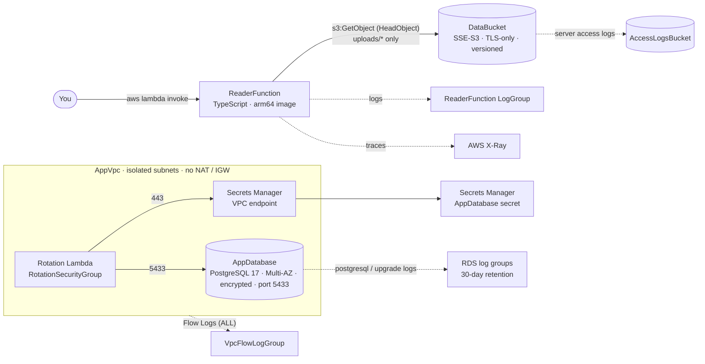

# AWS CDK Nag — Step-by-Step Security Tutorial

[](https://github.com/EduardoTayupanta/aws-cdk-nag-security-tutorial/actions/workflows/cdk-nag-check.yml)


Static security analysis for AWS CDK with [`cdk-nag`](https://github.com/cdklabs/cdk-nag), learned by fixing a real stack. The repo holds the same resources twice: an `InsecureStack` with 13 common flaws written on purpose, and a `SecureStack` that remediates every one of them. Unit tests prove that cdk-nag catches each flaw in the first and none in the second, and also catch the bugs cdk-nag cannot see. Every example is verified against **cdk-nag 3.x** and **aws-cdk-lib 2.27x**.

This repository accompanies a documentation series for the
[AWS Community Builders](https://aws.amazon.com/developer/community/community-builders/)
program (category: **Security & Identity**). Content is added step by step, so `main` reflects the current state of the series, not a finished demo.

## Why This Repo Exists

Most cdk-nag tutorials stop at "add the Aspect and fix the red lines", often with the 2.x API. This repo goes further:

- **Every claim is a test.** If a future cdk-nag release stops flagging one of the documented flaws, the build fails.
- **It shows where cdk-nag ends.** The first `SecureStack` passed every rule but its secret rotation could not have worked. The tests that catch that kind of bug are part of the content.
- **Suppressions are scoped and audited**: two in total, each on one exact finding, with a test pinning exactly what each one allows.

```
S3  →  IAM + Lambda  →  VPC  →  RDS + Secrets Manager  →  Suppressions, tests & CI
```

| Step | Service | Status | Focus |
|------|---------|--------|-------|
| 0 | — | ✅ Done | [cdk-nag 3.x: static security analysis before anything is deployed](docs/00-cdk-nag-concepts.md) |
| 1 | S3 | ✅ Done | [Access logs, public access and TLS (S1 / S2 / S10)](docs/01-s3-buckets.md) |
| 2 | IAM, Lambda | ✅ Done | [The hidden IAM4, the IAM5 fix that still triggers IAM5, an arm64 container image (IAM4 / IAM5 / L1)](docs/02-iam-and-lambda.md) |
| 3 | VPC | ✅ Done | [Flow Logs, isolated subnets and a closed endpoint (VPC7 / EC23)](docs/03-vpc-flow-logs.md) |
| 4 | RDS, Secrets Manager | ✅ Done | [Encryption, rotation and the bug cdk-nag can't see (RDS2/3/10/11, SMG4)](docs/04-rds-secret-rotation.md) |
| 5 | — | ✅ Done | [Suppressions, tests and CI: making the checks hard to game](docs/05-suppressions-testing-ci.md) |
| 6 | KMS | 📝 Planned | Customer-managed keys across S3, Secrets Manager and CloudWatch Logs |

## Architecture

`SecureStack`, as synthesized. You invoke `ReaderFunction` directly; it reads object metadata under `uploads/` in `DataBucket` (it is not in the VPC). The database lives in isolated subnets with no internet route; its rotation function reaches Secrets Manager only through a VPC endpoint opened to its own security group. Solid arrows are requests; dotted arrows are logs and traces.



## Tech Stack

| Layer | Choice | Why |
|-------|--------|-----|
| IaC | AWS CDK v2 (TypeScript) | The thing cdk-nag analyzes; type-checked infrastructure |
| Security checks | cdk-nag 3.x (`AwsSolutionsChecks`) | Registered through CDK's native `Validations` plugin API |
| Lambda | TypeScript (Node.js 22), arm64 container image | esbuild bundle on `public.ecr.aws/lambda/nodejs:22`; AWS access only through a gateway |
| Database | Amazon RDS for PostgreSQL 17 | Triggers five rules at once, including the rotation path |
| Tests | Jest + `aws-cdk-lib/assertions` | `validateScope()` for cdk-nag, `Template`/`Match` for everything it can't see |
| CI | GitHub Actions | Read-only token, SHA-pinned actions, native arm64 image build |

## Security & Compliance

- **cdk-nag is registered once at the `App` level** in [`buildApp()`](lib/app.ts), so every stack is checked during `cdk synth`. Any `ERROR` fails the synth and the pipeline.
- **Suppressions are scoped, justified and audited.** `SecureStack` has exactly two, each on one exact finding:
  - `AwsSolutions-IAM5[Resource::<DataBucket.Arn>/uploads/*]`: a prefix is the narrowest scope for objects created at runtime ([lib/secure-stack.ts](lib/secure-stack.ts)).
  - `AwsSolutions-IAM5[Resource::*]`: X-Ray does not support resource-level permissions ([lib/constructs/reader-function.ts](lib/constructs/reader-function.ts)).

  A test fails if a third suppression appears. Another pins the role's exact statements, because a `Resource::` acknowledgment would otherwise hide a new action on that resource ([Step 5](docs/05-suppressions-testing-ci.md)).
- **Least privilege beyond IAM**: a dedicated Lambda role (no managed policies), isolated subnets with no NAT or IGW, an endpoint open to one security group, and rotation egress limited to two destinations.
- **Not covered by design**: customer-managed KMS keys and the other NIST 800-53 / HIPAA findings. They are listed in [Step 5](docs/05-suppressions-testing-ci.md#other-rule-packs) and planned for Step 6.

## Documentation

- [`docs/00-cdk-nag-concepts.md`](docs/00-cdk-nag-concepts.md): what cdk-nag is, the 3.x API, how to read findings.
- [`docs/01-s3-buckets.md`](docs/01-s3-buckets.md): S1/S2/S10, and why the logs bucket needs no logging.
- [`docs/02-iam-and-lambda.md`](docs/02-iam-and-lambda.md): IAM4/IAM5/L1, the arm64 container image, the gateway pattern.
- [`docs/03-vpc-flow-logs.md`](docs/03-vpc-flow-logs.md): VPC7, isolated subnets, `open: false` and EC23.
- [`docs/04-rds-secret-rotation.md`](docs/04-rds-secret-rotation.md): five RDS/SMG rules, rotation, log retention.
- [`docs/05-suppressions-testing-ci.md`](docs/05-suppressions-testing-ci.md): `acknowledge()` semantics, test layers, CI, lessons learned.

More articles are added as each step is built.

## Prerequisites

To build, test and synthesize locally:

- **Node.js 22.13+** with npm (matches `engines` and CI).

That is all: `npm test` and `cdk synth` need **no AWS credentials and no Docker**.

Additionally, to deploy:

- An AWS account you're allowed to create resources in (a sandbox account is best).
- [AWS CLI v2](https://docs.aws.amazon.com/cli/latest/userguide/getting-started-install.html) with credentials configured; `aws sts get-caller-identity` shows the expected account.
- Docker (or Finch/Podman via `CDK_DOCKER`) to build the `ReaderFunction` image. On an x86 machine, Docker needs arm64 emulation (Docker Desktop includes it).
- A one-time CDK bootstrap of the target account/Region:

  ```bash
  npx cdk bootstrap aws://ACCOUNT-ID/REGION
  ```

> **Cost warning:** deploying creates billable resources. Billed **hourly even while idle**: **RDS Multi-AZ** (`db.t4g.micro` × 2, 20 GB gp3 each) and a **Secrets Manager interface VPC endpoint** in 2 AZs. Also billed: the Secrets Manager secret, CloudWatch Logs ingestion and storage (Flow Logs, function and RDS logs), and S3 storage. Treat a deploy as ephemeral and [tear it down](#tear-it-down) when done.
>
> **Never deploy `InsecureStack`**: it has a bucket without public access blocking and a role with `s3:*` on `*`.

## Getting Started

```bash
git clone https://github.com/EduardoTayupanta/aws-cdk-nag-security-tutorial.git
cd aws-cdk-nag-security-tutorial
npm ci
npm ci --prefix lambda/reader

npm run build           # tsc for the CDK app + typecheck for lambda/reader
npm test                # CDK + cdk-nag tests (100% coverage)
npm run test:lambda     # Lambda tests (100% coverage)
npm run synth           # SecureStack: passes cdk-nag ✅
npm run synth:insecure  # InsecureStack: cdk-nag reports 13 errors ❌
npx cdk deploy SecureStack   # requires the deploy prerequisites above
```

## Running the Tests

### 1. CDK app and cdk-nag (`test/`)

```bash
npm test -- --coverage
```

48 tests in 5 suites; **100%** statements, branches, functions and lines on `lib/`, enforced by `coverageThreshold` in [`jest.config.js`](jest.config.js). This suite covers the App wiring with a real synth, cdk-nag on both stacks, every remediation in the synthesized template, the `ReaderFunction` construct in isolation, and the `acknowledge()` semantics.

### 2. ReaderFunction handler (`lambda/reader/test/`)

```bash
npm run test:lambda
```

14 tests in 4 suites; **100%** on `lambda/reader/src`, enforced by the sub-project's own [`jest.config.js`](lambda/reader/jest.config.js). This suite covers the business logic against an in-memory fake, the S3 gateway with `S3Client.send` spied, config validation, and a wiring smoke test.

Each test that guards a remediation was also checked by deleting the remediation and confirming the suite fails. Coverage alone would not show that.

## Try It End to End

Run once in a sandbox account after `npx cdk deploy SecureStack`. Data in [`samples/`](samples) is synthetic.

### 1. Get the stack outputs

```bash
aws cloudformation describe-stacks --stack-name SecureStack \
  --query "Stacks[0].Outputs" --output table

BUCKET=$(aws cloudformation describe-stacks --stack-name SecureStack \
  --query "Stacks[0].Outputs[?OutputKey=='DataBucketName'].OutputValue" --output text)
FUNCTION=$(aws cloudformation describe-stacks --stack-name SecureStack \
  --query "Stacks[0].Outputs[?OutputKey=='ReaderFunctionName'].OutputValue" --output text)
```

### 2. Upload the sample file

```bash
aws s3 cp samples/uploads/report.csv "s3://$BUCKET/uploads/report.csv"
```

### 3. Invoke the function

```bash
aws lambda invoke --function-name "$FUNCTION" \
  --cli-binary-format raw-in-base64-out \
  --payload file://samples/reader-event.json response.json && cat response.json
```

Expected output:

```json
{"key":"uploads/report.csv","sizeBytes":198}
```

### 4. Check what the function is *not* allowed to do

```bash
aws lambda invoke --function-name "$FUNCTION" \
  --cli-binary-format raw-in-base64-out \
  --payload file://samples/reader-event-missing.json response.json && cat response.json
```

The response is a function error carrying S3's **403**, not a 404 `NotFound`: without `s3:ListBucket`, callers cannot probe which keys exist. Traces are in the X-Ray console, and logs are here:

```bash
aws logs tail "$(aws lambda get-function-configuration --function-name "$FUNCTION" \
  --query LoggingConfig.LogGroup --output text)" --since 10m
```

### 5. Confirm rotation is configured

```bash
SECRET=$(aws cloudformation describe-stacks --stack-name SecureStack \
  --query "Stacks[0].Outputs[?OutputKey=='DatabaseSecretArn'].OutputValue" --output text)
aws secretsmanager describe-secret --secret-id "$SECRET" \
  --query "{RotationEnabled: RotationEnabled, Rules: RotationRules}"
```

`RotationEnabled` is `true`, with a 30-day schedule.

## Tear It Down

The stack is a demo: buckets auto-delete their objects, and every bucket, log group and the database use `RemovalPolicy.DESTROY`. That is a **demo-only** choice; production data stores would use `RETAIN` / `SNAPSHOT`. The database keeps **deletion protection** (the RDS10 lesson), so turn it off first:

```bash
aws rds modify-db-instance --db-instance-identifier secure-stack-app-db \
  --no-deletion-protection --apply-immediately
aws rds wait db-instance-available --db-instance-identifier secure-stack-app-db

npx cdk destroy SecureStack
npx cdk gc --unstable=gc   # reclaim bootstrap assets (the container image)
```

## Repository Structure (evolving)

```
aws-cdk-nag-security-tutorial/
├── bin/
│   └── app.ts                         # Entry point: buildApp(new App())
├── lib/
│   ├── app.ts                         # Step 0 · buildApp(): stacks + cdk-nag at the App level
│   ├── insecure-stack.ts              # Steps 1–4 · "Before": deliberately introduced flaws
│   ├── secure-stack.ts                # Steps 1–4 · "After": same IDs, remediated
│   └── constructs/
│       └── reader-function.ts         # Step 2 · arm64 image Lambda, log group, X-Ray
├── lambda/
│   └── reader/                        # Step 2 · self-contained TypeScript sub-project
│       ├── src/                       #   index (wiring), config, describe-upload, gateways/s3-gateway
│       ├── test/                      #   100% coverage, own jest.config.js
│       └── Dockerfile                 #   esbuild bundle → public.ecr.aws/lambda/nodejs:22
├── test/
│   ├── helpers.ts                     # App with cdk.json context, validateScope, suppression audit
│   ├── app.test.ts                    # App wiring + real synth with cdk-nag
│   ├── insecure-stack.test.ts         # cdk-nag detects every documented flaw
│   ├── secure-stack.test.ts           # cdk-nag passes + every remediation
│   ├── acknowledge.test.ts            # Step 5 · Validations.acknowledge() semantics
│   └── constructs/
│       └── reader-function.test.ts    # Step 2 · ReaderFunction in isolation
├── docs/                              # The article series (00–05)
├── samples/                           # Synthetic input for "Try It End to End"
├── .github/
│   ├── workflows/cdk-nag-check.yml    # CI: typecheck, both test suites, synth, arm64 image build
│   └── dependabot.yml                 # npm (both projects), Docker, actions
├── cdk.json
├── jest.config.js                     # 100% coverage threshold
├── package.json
└── tsconfig.json
```

## Additional Resources

- cdk-nag: <https://github.com/cdklabs/cdk-nag> · [rules](https://github.com/cdklabs/cdk-nag/blob/main/RULES.md)
- AWS CDK — testing constructs: <https://docs.aws.amazon.com/cdk/v2/guide/testing.html>
- AWS Prescriptive Guidance — CDK best practices: <https://docs.aws.amazon.com/prescriptive-guidance/latest/best-practices-cdk-typescript-iac/>

## License

[MIT](LICENSE)
