# AWS CDK Nag — Step-by-Step Security Tutorial

[](https://github.com/EduardoTayupanta/aws-cdk-nag-security-tutorial/actions/workflows/cdk-nag-check.yml)


Static security analysis for AWS CDK with [`cdk-nag`](https://github.com/cdklabs/cdk-nag): how to install and configure it, how to read the findings it reports, and how to remediate the most common ones.

This repository goes beyond snippets: it contains **two real stacks** with the same resources (one with deliberately introduced flaws, `InsecureStack`, and one remediated, `SecureStack`) plus **tests that prove** cdk-nag detects every flaw in the first and none in the second. Every example in this README is taken from that code and verified against **cdk-nag 3.x** and **aws-cdk-lib 2.27x**.

Written as part of a series for the [AWS Community Builders](https://aws.amazon.com/developer/community/community-builders/) program.

## Table of Contents

1. [What Is cdk-nag?](#what-is-cdk-nag)
2. [Quick Start](#quick-start)
3. [Prerequisites](#prerequisites)
4. [Installation](#installation)
5. [Basic Configuration](#basic-configuration)
6. [Running the Analysis](#running-the-analysis)
7. [How to Read the Findings](#how-to-read-the-findings)
8. [Common Findings and How to Remediate Them](#common-findings-and-how-to-remediate-them)
9. [Suppressing Justified Findings](#suppressing-justified-findings)
10. [Testing Compliance with Unit Tests](#testing-compliance-with-unit-tests)
11. [CI/CD Integration](#cicd-integration)
12. [Lessons Learned](#lessons-learned)
13. [Deploying (Optional) and Costs](#deploying-optional-and-costs)
14. [Repository Structure](#repository-structure)
15. [Additional Resources](#additional-resources)

## What Is cdk-nag?

`cdk-nag` is a library that runs during AWS CDK synthesis (`cdk synth`) and validates the generated resources against rule packs for security and best practices (**NagPacks**), such as:

- **AwsSolutionsChecks** — general best practices from the AWS Solutions Library (the pack used in this tutorial).
- **HIPAASecurityChecks** — HIPAA-oriented controls.
- **NIST80053R5Checks** — NIST 800-53 Rev. 5 controls.
- **PCIDSS321Checks** — PCI DSS v3.2.1 controls.

Starting with version 3.x, cdk-nag integrates as a **native CDK validation plugin** (`Validations`): it inspects the CloudFormation template about to be generated and reports findings in the console (or fails the build) without deploying anything.

> **Coming from cdk-nag 2.x?** The API has changed: `Aspects.of(app).add(new AwsSolutionsChecks())` becomes `Validations.of(app).addPlugins(new AwsSolutionsChecks(app))`, and `NagSuppressions.addResourceSuppressions(...)` becomes `Validations.of(construct).acknowledge(...)`. This entire tutorial uses the 3.x API.

## Quick Start

```bash
git clone https://github.com/EduardoTayupanta/aws-cdk-nag-security-tutorial.git
cd aws-cdk-nag-security-tutorial
npm ci

npm test                # CDK, cdk-nag and Lambda handler unit tests (100% coverage)
npm run synth           # synthesizes SecureStack: passes cdk-nag ✅
npm run synth:insecure  # synthesizes InsecureStack: cdk-nag reports 13 errors ❌
```

None of these commands require AWS credentials.

```mermaid
flowchart LR
    subgraph before["InsecureStack (before)"]
        direction TB
        a1["DataBucket<br/>no logs · public · no TLS"]
        a2["AppRole<br/>AmazonS3FullAccess + s3:* on *"]
        a3["ReaderFunction<br/>nodejs20.x"]
        a4["AppVpc<br/>no Flow Logs"]
        a5["AppDatabase<br/>unencrypted · no protection · no rotation"]
    end
    subgraph after["SecureStack (after)"]
        direction TB
        b1["DataBucket<br/>access logs · BLOCK_ALL · enforceSSL"]
        b2["AppRole<br/>s3:GetObject on uploads/* only"]
        b3["ReaderFunction<br/>nodejs24.x · dedicated log group"]
        b4["AppVpc<br/>Flow Logs · isolated subnets · no NAT"]
        b5["AppDatabase<br/>encrypted · Multi-AZ · rotation via VPC endpoint · log retention"]
    end
    before -- "cdk-nag: 13 errors → 0" --> after
```



## Prerequisites

- Node.js 22.13+ and npm.
- AWS CDK v2 (`npx cdk` uses the project's local version; no global install required).
- A TypeScript CDK project (the same concepts apply to Python/Java/.NET/Go).
- Basic familiarity with `App`, `Stack`, and `Construct` in CDK.

## Installation

From the root of your CDK project:

```bash
npm install cdk-nag
```

Check the installed version (this tutorial requires 3.x):

```bash
npm list cdk-nag
```

## Basic Configuration

The rule pack is registered **once, at the `App` level**, so any stack added later is covered without extra wiring. In a minimal app that is all of it:

```typescript
#!/usr/bin/env node
import 'source-map-support/register';
import { App, Validations } from 'aws-cdk-lib/core';
import { AwsSolutionsChecks } from 'cdk-nag';
import { SecureStack } from '../lib/secure-stack';

const app = new App();
new SecureStack(app, 'SecureStack');

Validations.of(app).addPlugins(new AwsSolutionsChecks(app, { verbose: true }));
```

The `verbose: true` option adds each rule's full explanation to the report, which makes remediation much easier.

In this repo the same wiring lives in `buildApp()` ([lib/app.ts](lib/app.ts)), and [bin/app.ts](bin/app.ts) only calls `buildApp(new App())`. That keeps the wiring itself under unit test ([test/app.test.ts](test/app.test.ts)). `InsecureStack` is only added when you pass `-c includeInsecure=true`, so a default `cdk synth` (and the pipeline) stays green.

## Running the Analysis

cdk-nag runs automatically every time the app is synthesized:

```bash
npx cdk synth
```

To see the findings for the insecure stack:

```bash
npx cdk synth InsecureStack -c includeInsecure=true
```

Excerpt of the actual output:

```
ERROR The S3 Bucket has server access logs disabled. The bucket should have server access logging enabled to provide detailed records for the requests that are made to the bucket. (AwsSolutions)
   InsecureStack/DataBucket/Resource aws-cdk-lib.aws_s3.CfnBucket
   Acknowledge with 'AwsSolutions::AwsSolutions-S1'

ERROR The IAM entity contains wildcard permissions and does not have a cdk-nag rule suppression with evidence for those permission. [...]
   InsecureStack/AppRole/DefaultPolicy/Resource aws-cdk-lib.aws_iam.CfnPolicy
   Acknowledge with 'AwsSolutions-IAM5[Action::s3:*]'

WARNING Runtime: Runtime 'nodejs20.x' was deprecated on '2026-04-30'. [...] (CloudFormation Validate)
   InsecureStack/ReaderFunction/Resource (ReaderFunctionD0BD5D14) aws-cdk-lib.aws_lambda.CfnFunction
   Acknowledge with 'CloudFormation-Validate::W2531'
Synthesis finished with errors
```

An `ERROR`-level finding makes `cdk synth` (and therefore `cdk deploy`) exit with a non-zero code. In addition to the console output, the full report is written to `cdk.out/validation-report.json`.

## How to Read the Findings

Each finding has this shape:

```
<LEVEL> <Rule description> (<Rule pack>)
   <Construct path> <L1 type>
   Acknowledge with '<Finding ID>'
```

- **Level**: `ERROR` (blocks synth/deploy) or `WARNING` (informational).
- **Construct path**: the exact location of the resource in the construct tree (`InsecureStack/DataBucket/Resource`); it matches the IDs in your code.
- **Finding ID**: the rule (`AwsSolutions-S1`) or, for *granular* rules such as IAM4/IAM5, the rule plus the specific finding (`AwsSolutions-IAM5[Action::s3:*]`). Look it up in [RULES.md](https://github.com/cdklabs/cdk-nag/blob/main/RULES.md) for the full explanation.
- **Rule pack**: besides `AwsSolutions`, CDK runs its own validator (`CloudFormation Validate`), which also surfaces useful warnings such as deprecated runtimes.

Practical advice: fix the highest-impact findings first (public access, encryption, overly permissive IAM), then move on to *hardening* (logging, runtime versions, ports).

## Common Findings and How to Remediate Them

All snippets come from [lib/insecure-stack.ts](lib/insecure-stack.ts) (before) and [lib/secure-stack.ts](lib/secure-stack.ts) (after). Both use **the same construct IDs**, which makes them easy to compare.

### AwsSolutions-S1 / S2 / S10 — S3 bucket without access logs, public, or without TLS

```typescript
// Before: S1 (no logs), S2 (public access not blocked), S10 (TLS not enforced)
new Bucket(this, 'DataBucket', {
  blockPublicAccess: new BlockPublicAccess({
    blockPublicAcls: false, blockPublicPolicy: false,
    ignorePublicAcls: false, restrictPublicBuckets: false,
  }),
});

// After
const accessLogsBucket = new Bucket(this, 'AccessLogsBucket', {
  encryption: BucketEncryption.S3_MANAGED, // SSE-KMS is not supported as a log destination
  versioned: true,
  blockPublicAccess: BlockPublicAccess.BLOCK_ALL,
  enforceSSL: true,
  objectOwnership: ObjectOwnership.BUCKET_OWNER_ENFORCED,
  lifecycleRules: [{ id: 'expire-access-logs', expiration: Duration.days(365) }],
});

new Bucket(this, 'DataBucket', {
  encryption: BucketEncryption.S3_MANAGED,
  blockPublicAccess: BlockPublicAccess.BLOCK_ALL, // S2
  enforceSSL: true,                               // S10
  versioned: true,
  objectOwnership: ObjectOwnership.BUCKET_OWNER_ENFORCED,
  serverAccessLogsBucket: accessLogsBucket,       // S1
  serverAccessLogsPrefix: 'data-bucket/',
});
```

Doesn't the logs bucket need logging of its own? No: rule S1 treats a bucket that is already an access-log **destination** as compliant, with no suppression needed. It also has to stay on SSE-S3, because S3 server access logging cannot deliver to a bucket that uses SSE-KMS default encryption.

### AwsSolutions-IAM4 — Use of AWS managed policies

```typescript
// Before
appRole.addManagedPolicy(ManagedPolicy.fromAwsManagedPolicyName('AmazonS3FullAccess'));
```

A less obvious case: **every Lambda function using the default role** gets the `AWSLambdaBasicExecutionRole` managed policy and triggers IAM4. You could suppress it (it only grants CloudWatch Logs permissions), but it is better to give the function its own role and scope log permissions to **a single** log group:

```typescript
// After
const appRole = new Role(this, 'AppRole', {
  assumedBy: new ServicePrincipal('lambda.amazonaws.com'),
});
const readerLogGroup = new LogGroup(this, 'ReaderLogGroup', { retention: RetentionDays.ONE_MONTH });
readerLogGroup.grantWrite(appRole);

new Function(this, 'ReaderFunction', { /* ... */ role: appRole, logGroup: readerLogGroup });
```

A dedicated role also means *you* must grant everything the function needs. Forgetting `grantWrite` passes cdk-nag and synthesizes fine, but the function cannot write logs, so a unit test pins that grant.

### AwsSolutions-IAM5 — Wildcard (`*`) permissions in Action or Resource

```typescript
// Before: two findings, IAM5[Action::s3:*] and IAM5[Resource::*]
appRole.addToPolicy(new PolicyStatement({ actions: ['s3:*'], resources: ['*'] }));

// After: one action, one prefix
appRole.addToPolicy(new PolicyStatement({
  sid: 'ReadUploadsPrefixOnly',
  actions: ['s3:GetObject'],
  resources: [dataBucket.arnForObjects('uploads/*')],
}));
```

> ⚠️ **Heads up:** this **still triggers IAM5** (`IAM5[Resource::<DataBucketE3889A50.Arn>/uploads/*]`) because the ARN ends in `*`. That is expected: an S3 prefix is the narrowest possible scope for objects created at runtime. The right move here is to **acknowledge that specific finding with a justification** (see [Suppressing Justified Findings](#suppressing-justified-findings)), not to broaden the permission.
>
> Why not `bucket.grantRead(role, 'uploads/*')`? It works, but it also grants `s3:GetObject*`, `s3:GetBucket*`, and `s3:List*`: three more IAM5 findings to justify for a function that only reads objects.
>
> Without `s3:ListBucket`, `HeadObject` on a missing key returns **403 AccessDenied** instead of 404. That is intentional: callers cannot probe which keys exist. The handler ([lambda/reader/index.js](lambda/reader/index.js)) documents it.

### AwsSolutions-L1 — Lambda not using the latest runtime

```typescript
// Before
runtime: Runtime.NODEJS_20_X,

// After
runtime: Runtime.NODEJS_24_X,
```

The version is pinned explicitly instead of using `Runtime.NODEJS_LATEST`, whose value can change when you upgrade `aws-cdk-lib` and silently modify the template.

Expect L1 to fire again one day: once a cdk-nag release knows about a newer Node.js runtime, `nodejs24.x` stops being "the latest" and the build turns red. The lockfile plus `npm ci` means that only happens on a deliberate upgrade (for example a Dependabot PR), which is exactly when you want to hear about it.

### AwsSolutions-VPC7 — VPC without Flow Logs

```typescript
const vpc = new Vpc(this, 'AppVpc', {
  maxAzs: 2,
  natGateways: 0,
  subnetConfiguration: [{ name: 'isolated', subnetType: SubnetType.PRIVATE_ISOLATED }],
  flowLogs: {
    FlowLog: {
      destination: FlowLogDestination.toCloudWatchLogs(
        new LogGroup(this, 'VpcFlowLogGroup', { retention: RetentionDays.ONE_YEAR }),
      ),
    },
  },
});
```

The subnets are isolated and there is no NAT Gateway: the database has no need to reach the internet. Lower cost and a smaller attack surface.

### AwsSolutions-RDS2 / RDS3 / RDS10 / RDS11 / SMG4 — RDS database

A single RDS instance with default settings triggers **five** rules:

| Rule | Problem | Remediation |
|------|---------|-------------|
| RDS2  | Storage not encrypted | `storageEncrypted: true` |
| RDS3  | No Multi-AZ | `multiAz: true` |
| RDS10 | No deletion protection | `deletionProtection: true` |
| RDS11 | Default port (5432) | `port: 5433` |
| SMG4  | Password secret is not rotated | `addRotationSingleUser()` |

```typescript
const database = new DatabaseInstance(this, 'AppDatabase', {
  instanceIdentifier: DB_INSTANCE_IDENTIFIER, // 'secure-stack-app-db'
  engine: DatabaseInstanceEngine.postgres({ version: PostgresEngineVersion.VER_17 }),
  instanceType: InstanceType.of(InstanceClass.T4G, InstanceSize.MICRO),
  allocatedStorage: 20,
  storageType: StorageType.GP3,
  vpc,
  vpcSubnets: { subnetType: SubnetType.PRIVATE_ISOLATED },
  storageEncrypted: true,   // RDS2
  deletionProtection: true, // RDS10
  multiAz: true,            // RDS3
  port: 5433,               // RDS11
  iamAuthentication: true,
  backupRetention: Duration.days(7),
  cloudwatchLogsExports: ['postgresql', 'upgrade'],
});
```

Log exports have a trap of their own: RDS creates the export log groups with **"Never expire"** retention. The obvious fix, `cloudwatchLogsRetention`, adds a `Custom::LogRetention` Lambda that brings **new** IAM4/IAM5 findings. Instead, the stack fixes the instance identifier and creates the log groups itself, before the database:

```typescript
const dbLogGroups = new Construct(this, 'AppDatabaseLogGroups');
for (const logType of ['postgresql', 'upgrade']) {
  database.node.addDependency(new LogGroup(dbLogGroups, logType, {
    logGroupName: `/aws/rds/instance/${DB_INSTANCE_IDENTIFIER}/${logType}`,
    retention: RetentionDays.ONE_MONTH,
  }));
}
```

Rotation (SMG4) is the tricky part. The rotation Lambda runs **inside** the VPC, which has no internet egress, so it needs a Secrets Manager VPC endpoint:

```typescript
// `open: false`: skips the default rule that opens the endpoint to the entire
// VPC CIDR (that rule also prevents AwsSolutions-EC23 from being evaluated).
const secretsManagerEndpoint = vpc.addInterfaceEndpoint('SecretsManagerEndpoint', {
  service: InterfaceVpcEndpointAwsService.SECRETS_MANAGER,
  subnets: { subnetType: SubnetType.PRIVATE_ISOLATED },
  open: false,
});

// allowAllOutbound: false → egress only to the endpoint (443) and the database port.
const rotationSecurityGroup = new SecurityGroup(this, 'RotationSecurityGroup', { vpc, allowAllOutbound: false });
secretsManagerEndpoint.connections.allowDefaultPortFrom(rotationSecurityGroup); // 443, from the rotation function only

database.addRotationSingleUser({
  endpoint: secretsManagerEndpoint,
  securityGroup: rotationSecurityGroup,
});
```

> The `endpoint` option of `addRotationSingleUser` **only changes the URL** the Lambda uses; it does **not** open the endpoint's security group. Without the `allowDefaultPortFrom` line, the stack passes cdk-nag and synthesizes cleanly, but rotation fails at runtime. See [Lessons Learned](#lessons-learned).

## Suppressing Justified Findings

Not every finding applies in every context. For those cases, use `Validations.of(...).acknowledge()` **on the specific construct** with an explicit justification, instead of disabling the rule:

```typescript
import { Validations } from 'aws-cdk-lib/core';

Validations.of(appRole).acknowledge({
  id: 'AwsSolutions-IAM5[Resource::<DataBucketE3889A50.Arn>/uploads/*]',
  reason:
    'The "*" is the deliberate prefix scope: the function can only call s3:GetObject ' +
    'on objects under uploads/ in this bucket. S3 object keys are created at runtime and cannot be ' +
    'enumerated in advance, so a prefix is the narrowest possible scope for object reads.',
});
```

In `SecureStack`, this is **the only** suppression. In the code, the bucket's logical ID is computed with `this.getLogicalId(...)` instead of being hard-coded, so it does not break if the hash changes.

Rules worth knowing (all backed by [test/acknowledge.test.ts](test/acknowledge.test.ts)):

- **Use the plain ID:** `AwsSolutions-S1`. The CLI suggests `AwsSolutions::AwsSolutions-S1`; `cdk synth` accepts both, but `validateScope()` (what the tests use) accepts **only** the plain one.
- **Granular rules are acknowledged finding by finding.** Acknowledging `AwsSolutions-IAM5[Action::s3:*]` does not hide `AwsSolutions-IAM5[Resource::*]`, and acknowledging the base ID `AwsSolutions-IAM5` hides neither. So a wildcard on any *other* resource or action added to the role later is reported again.
- **An acknowledgment covers more than it looks.** A `Resource::` acknowledgment also hides any *new action* on that same resource: adding `s3:DeleteObject` on `uploads/*` would pass cdk-nag silently. Pin what the suppression is meant to allow with a unit test; [test/secure-stack.test.ts](test/secure-stack.test.ts) asserts that `s3:GetObject` is the role's only S3 action.
- **Write the reason for a skeptical reviewer.** "It's required" or "not applicable" are not reasons. Explain why the risk the rule guards against does not apply to that resource. The reason lives in the code and in the construct metadata (`aws:cdk:acknowledged-rules`), and serves as evidence during audits.

## Testing Compliance with Unit Tests

cdk-nag 3.x exposes `validateScope()`, which runs the rule pack against a stack inside a unit test, without `cdk synth`:

```typescript
test('passes the AWS Solutions (cdk-nag) rule pack with no violations', () => {
  const report = new AwsSolutionsChecks().validateScope(stack);
  if (!report.success) {
    // Fail with the actual violations printed, not just "false !== true".
    throw new Error(`AwsSolutions violations:\n${JSON.stringify(report.violations, null, 2)}`);
  }
  expect(report.success).toBe(true);
});
```

The tests in this repo cover four layers:

| File | What it tests |
|------|---------------|
| [test/app.test.ts](test/app.test.ts) | The App wiring: only `SecureStack` by default, `includeInsecure` adds `InsecureStack`, and a real `app.synth()` with cdk-nag registered passes or throws accordingly. |
| [test/insecure-stack.test.ts](test/insecure-stack.test.ts) | That cdk-nag **does** report each of the 13 rules covered in the tutorial. If a future cdk-nag version stopped detecting any of them, the tutorial would be teaching something false. |
| [test/secure-stack.test.ts](test/secure-stack.test.ts) | That the stack passes cdk-nag; that there is **exactly one** suppression (the IAM5 one); and, using `Template`/`Match`, every remediation in the generated CloudFormation, including what cdk-nag cannot see: the endpoint ingress rule, the rotation egress rules, the log-write grant, and that `s3:GetObject` is the only S3 action. |
| [test/acknowledge.test.ts](test/acknowledge.test.ts) | The `acknowledge()` behavior described in the previous section. |
| [test/lambda/reader.test.ts](test/lambda/reader.test.ts) | The Lambda handler's runtime logic, mocking `S3Client.prototype.send`: the key it reads, input validation, and error propagation. |

The tests load the `context` from `cdk.json` explicitly (`new App({ context: cdkJson.context })`): feature flags are only applied by the `cdk` CLI, not by a bare `new App()`. `jest.config.js` enforces **100% coverage** (statements, branches, functions and lines) on `lib/` and `lambda/`.

Every test that guards a remediation was checked by deleting that remediation and confirming the suite goes red.

## CI/CD Integration

[.github/workflows/cdk-nag-check.yml](.github/workflows/cdk-nag-check.yml) runs on every push and pull request to `main`:

1. `npm ci` and typecheck (`tsc`).
2. `npm test -- --coverage`: tests and cdk-nag with a 100% coverage threshold.
3. `cdk synth` of `SecureStack`: if cdk-nag reports an `ERROR`, the job fails and the PR is blocked.
4. `cdk synth` of `InsecureStack`, which **must fail, and because of cdk-nag findings** (the step checks the output for `AwsSolutions-`, so a compile error does not count). If it passed, the tutorial would be showcasing flaws that cdk-nag no longer detects.

Best practices applied in the workflow:

- `permissions: contents: read`: a least-privilege GitHub token.
- Actions pinned by **commit SHA** instead of mutable tags, with `persist-credentials: false`.
- `concurrency` to cancel stale runs, plus `timeout-minutes`.
- [Dependabot](.github/dependabot.yml) keeps `aws-cdk-lib`/`cdk-nag` (grouped) and the actions up to date, with a 7-day cooldown on npm releases as a buffer against freshly published malicious versions.
- No AWS credentials required: the analysis is 100% static.

## Lessons Learned

Things that only surfaced while building this for real, and that are worth knowing before rolling out cdk-nag across a team:

1. **Passing cdk-nag does not mean it works.** The first version of `SecureStack` passed every rule, but the rotation Lambda could not reach Secrets Manager: the endpoint had `open: false` and no ingress rule. cdk-nag checks for what is **excessive** (open permissions), not for what is **missing** (connectivity). A `Template` test caught it, not cdk-nag.
2. **Remediating one rule can expose another.** The endpoint's default "open" setting caused `AwsSolutions-EC23` to throw an error during evaluation (the ingress rule uses the VPC CIDR, an intrinsic value). The correct fix (opening it only to the rotation security group) is also the most secure one.
3. **The textbook IAM5 example still triggers IAM5.** `arnForObjects('*')` or `'uploads/*'` always ends in `*`. Accept it and acknowledge the specific finding with a reason, rather than pretending it is "already remediated".
4. **The default Lambda role is a hidden IAM4.** A dedicated role with `logGroup.grantWrite(role)` removes the managed policy and scopes log permissions to a single log group.
5. **Test the "before" too.** A test confirming that the insecure stack still fails protects the tutorial (and your internal rules) from silent behavior changes in new cdk-nag versions.
6. **The obvious fix can add findings.** `cloudwatchLogsRetention` on RDS fixes "Never expire" log groups, but its custom-resource Lambda brings new IAM4/IAM5 findings. Creating the log groups yourself is cleaner.
7. **Suppressions need a test of what they allow.** A `Resource::` acknowledgment silently covers any new action on that resource. cdk-nag will not tell you; a unit test will.
8. **Other rule packs are one line away.** Running `NIST80053R5Checks` or `HIPAASecurityChecks` on `SecureStack` adds findings such as customer-managed KMS keys and inline-policy restrictions. They are out of scope here, and some are false positives (e.g. `EC2RestrictedCommonPorts` on the database ingress rule, whose port is a CloudFormation token). Pick the pack that matches your compliance target, not the strictest one.

## Deploying (Optional) and Costs

The goal of this tutorial is static analysis; **you do not need to deploy anything**. If you want to deploy `SecureStack` to a sandbox account:

```bash
npx cdk bootstrap   # once per account/Region
npx cdk deploy SecureStack
```

Keep in mind:

- **It incurs costs**: RDS Multi-AZ (`db.t4g.micro` × 2, 20 GB gp3) and a Secrets Manager interface endpoint across 2 AZs are billed hourly, even when idle.
- **A single `cdk destroy` will not remove everything**, by design: the database has `deletionProtection: true` (and keeps a final snapshot), and the buckets and log groups use the default `RETAIN` removal policy. You must first disable deletion protection, then empty and delete the buckets manually.
- **Never deploy `InsecureStack`**: it contains a bucket without public access blocking and a role with `s3:*` on `*`.

## Repository Structure

```
aws-cdk-nag-security-tutorial/
├── bin/
│   └── app.ts                    # Entry point: buildApp(new App())
├── lib/
│   ├── app.ts                    # buildApp(): stacks + cdk-nag registered at the App level
│   ├── insecure-stack.ts         # "Before": deliberately introduced flaws
│   └── secure-stack.ts           # "After": same IDs, remediated
├── lambda/
│   └── reader/
│       └── index.js              # ReaderFunction handler (plain CommonJS, no bundling)
├── test/
│   ├── helpers.ts                # App with cdk.json context, validateScope, suppression audit
│   ├── app.test.ts               # App wiring + real synth with cdk-nag
│   ├── insecure-stack.test.ts    # cdk-nag detects every documented flaw
│   ├── secure-stack.test.ts      # cdk-nag passes + assertions for each remediation
│   ├── acknowledge.test.ts       # Validations.acknowledge() behavior
│   └── lambda/
│       └── reader.test.ts        # Handler unit tests (S3Client.send mocked)
├── .github/
│   ├── workflows/
│   │   └── cdk-nag-check.yml     # CI: typecheck, tests, cdk synth
│   └── dependabot.yml
├── cdk.json
├── jest.config.js                # 100% coverage threshold on lib/ and lambda/
├── package.json
├── tsconfig.json
└── README.md
```

## Additional Resources

- Official cdk-nag repository: <https://github.com/cdklabs/cdk-nag>
- Full list of `AwsSolutionsChecks` rules: <https://github.com/cdklabs/cdk-nag/blob/main/RULES.md>
- cdk-nag 2.x to 3.x migration guide: the *Migrating from v2* section of the [cdk-nag README](https://github.com/cdklabs/cdk-nag#readme)
- AWS CDK — testing infrastructure: <https://docs.aws.amazon.com/cdk/v2/guide/testing.html>
- AWS Prescriptive Guidance — security best practices for CDK: <https://docs.aws.amazon.com/prescriptive-guidance/latest/best-practices-cdk-typescript-iac/>

## License

[MIT](LICENSE)
